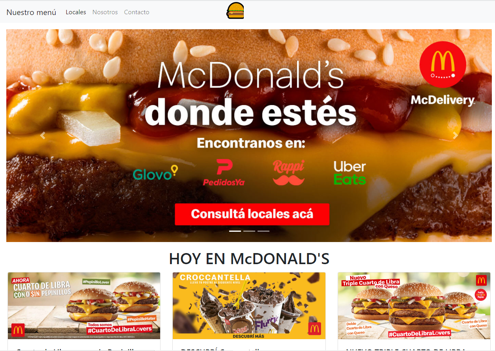

# MrMac 🍔🍟

Página web clon de McDonald's con los features realizados en <a href="https://gitlab.com/gonzalolamas/mrmac">GitLab</a>. La realicé con las siguientes tecnologías:

<ul>

<li>Html</li>
<li>Css</li>
<li>Bootstrap</li>
<li>JavaScript</li>

</ul>

# Screenshoots

<h3>Diseño web:</h3>

<h3>Diseño mobile:</h3>

<h3>Demo:</h3> 
https://mrmaccomit.netlify.app/
